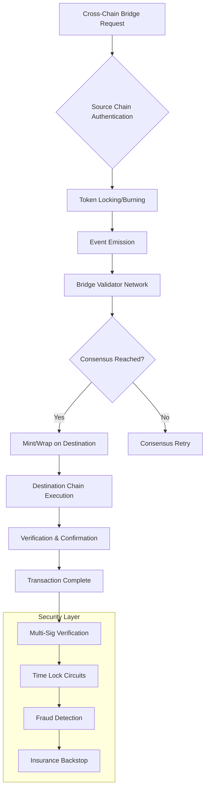

# 🚀 Comprehensive Cryptocurrency Ecosystem Overview 2026

The cryptocurrency landscape has evolved far beyond simple tokens and exchanges. Today's ecosystem encompasses sophisticated technologies, specialized platforms, and innovative applications. Here's a comprehensive guide to the major cryptocurrency topics and technologies currently shaping the industry.

## 📊 Core Cryptocurrency Topics & Technologies

### 1. **DeFi & Decentralized Finance**
**Beyond Traditional Banking**

```mermaid
graph TB
   [DeFi Ecosystem] --> B[Lending Protocols]
    A --> C[Decentralized Exchanges]
    A --> D[Yield Farming]
    A --> E[Staking Platforms]
    A --> F[Insurance Protocols]
    
    B --> G[Aave, Compound]
    C --> H[Uniswap, PancakeSwap]
    D --> I[Yearn Finance]
    E --> J[Lido, Rocket Pool]
    F --> K[Nexus Mutual]
    
    G --> L[Automated Strategies]
    H --> M[Liquidity Provision]
    I --> N[APY Optimization]
    J --> O[Staking Derivatives]
    K --> P[Smart Contract Coverage]
```

**Key Technologies:**
- **Automated Market Makers (AMMs)**: Algorithm-based liquidity protocols
- **Flash Loans**: Uncollateralized lending with atomic execution
- **Yield Aggregators**: Automated yield optimization across protocols
- **Stablecoin Ecosystems**: Algorithmic and collateral-backed stablecoins

### 2. **NFT & Digital Collectibles**
**Revolutionizing Digital Ownership**

```solidity
// Advanced NFT Contract with Royalties
pragma solidity ^0.8.20;

import "@openzeppelin/contracts/token/ERC721/ERC721.sol";
import "@openzeppelin/contracts/token/ERC721/extensions/ERC721Royalty.sol";

contract AdvancedNFT is ERC721, ERC721Royalty {
    struct NFTMetadata {
        string ipfsHash;
        address creator;
        uint256 creationTime;
        string[] attributes;
        uint256 editionNumber;
        uint256 maxEditions;
    }
    
    mapping(uint256 => NFTMetadata) public tokenMetadata;
    
    constructor() ERC721("AdvancedNFT", "ANFT") {}
    
    function mintAdvancedNFT(
        address to,
        string memory ipfsHash,
        string[] memory attributes,
        uint256 editionNumber,
        uint256 maxEditions,
        uint96 royaltyPercentage
    ) public returns (uint256) {
        uint256 tokenId = totalSupply() + 1;
        
        _safeMint(to, tokenId);
        _setTokenRoyalty(tokenId, msg.sender, royaltyPercentage);
        
        tokenMetadata[tokenId] = NFTMetadata({
            ipfsHash: ipfsHash,
            creator: msg.sender,
            creationTime: block.timestamp,
            attributes: attributes,
            editionNumber: editionNumber,
            maxEditions: maxEditions
        });
        
        return tokenId;
    }
}
```

**Innovative Applications:**
- **Gaming NFTs**: In-game assets and character ownership
- **Fractional NFT Ownership**: Shared ownership of high-value NFTs
- **Dynamic NFTs**: NFTs that evolve based on external conditions
- **Utility NFTs**: Access passes and subscription tokens

### 3. **Web3 & Decentralized Applications**
**Building the Decentralized Web**

```yaml
web3_ecosystem_components:
  infrastructure:
    - decentralized_storage: ["IPFS", "Arweave", "Filecoin"]
    - decentralized_compute: ["Internet Computer", "Akash", "Render"]
    - decentralized_identity: ["ENS", "SpruceID", "Ceramic"]
    
  development_frameworks:
    - ethereum: ["Hardhat", "Foundry", "Brownie"]
    - solana: ["Anchor", "Seahorse"]
    - cosmos: ["CosmWasm", "Ignite CLI"]
    
  middleware:
    - oracles: ["Chainlink", "API3", "Band Protocol"]
    - indexers: ["The Graph", "SubQuery", "Covalent"]
    - bridges: ["Wormhole", "LayerZero", "Axelar"]
```

### 4. **Smart Contract Development & Security**
**Building Trustless Applications**

```solidity
// Secure Multi-Sig Wallet Implementation
pragma solidity ^0.8.20;

contract MultiSigWallet {
    address[] public owners;
    mapping(address => bool) public isOwner;
    uint256 public requiredConfirmations;
    
    struct Transaction {
        address to;
        uint256 value;
        bytes data;
        bool executed;
        uint256 confirmationCount;
    }
    
    Transaction[] public transactions;
    mapping(uint256 => mapping(address => bool)) public isConfirmed;
    
    event Deposit(address indexed sender, uint256 amount);
    event SubmitTransaction(uint256 indexed txId);
    event ConfirmTransaction(address indexed owner, uint256 indexed txId);
    event ExecuteTransaction(uint256 indexed txId);
    
    constructor(address[] memory _owners, uint256 _requiredConfirmations) {
        require(_owners.length > 0, "Owners required");
        require(_requiredConfirmations > 0, "Confirmations required");
        require(_requiredConfirmations <= _owners.length, "Invalid confirmations");
        
        for (uint256 i = 0; i < _owners.length; i++) {
            address owner = _owners[i];
            require(owner != address(0), "Invalid owner");
            require(!isOwner[owner], "Owner not unique");
            
            isOwner[owner] = true;
            owners.push(owner);
        }
        
        requiredConfirmations = _requiredConfirmations;
    }
    
    modifier onlyOwner() {
        require(isOwner[msg.sender], "Not owner");
        _;
    }
    
    modifier txExists(uint256 _txId) {
        require(_txId < transactions.length, "Transaction doesn't exist");
        _;
    }
    
    modifier notExecuted(uint256 _txId) {
        require(!transactions[_txId].executed, "Already executed");
        _;
    }
    
    modifier notConfirmed(uint256 _txId) {
        require(!isConfirmed[_txId][msg.sender], "Already confirmed");
        _;
    }
}
```

**Security Protocols:**
- **Formal Verification**: Mathematical proof of contract correctness
- **Bug Bounty Programs**: Community-driven security identification
- **Time Locks**: Delayed execution for critical operations
- **Emergency Stop Mechanisms**: Circuit breakers for protection

### 5. **Blockchain Analytics & Intelligence**
**Data-Driven Decision Making**

```python
# Blockchain Analytics Pipeline
import pandas as pd
import numpy as np
from web3 import Web3
from datetime import datetime, timedelta

class BlockchainAnalytics:
    def __init__(self, rpc_url):
        self.web3 = Web3(Web3.HTTPProvider(rpc_url))
        self.chain_id = self.web3.eth.chain_id
        
    def analyze_transaction_patterns(self, address, days=30):
        """Analyze transaction patterns for risk assessment"""
        end_block = self.web3.eth.block_number
        start_block = self.get_historical_block(days)
        
        transactions = self.get_transactions_in_range(
            address, start_block, end_block
        )
        
        analysis = {
            'total_transactions': len(transactions),
            'unique_counterparties': self.get_unique_counterparties(transactions),
            'volume_analysis': self.calculate_volume_metrics(transactions),
            'time_patterns': self.analyze_timing_patterns(transactions),
            'risk_score': self.calculate_risk_score(transactions),
            'anomaly_detection': self.detect_anomalies(transactions)
        }
        
        return analysis
    
    def get_historical_block(self, days_ago):
        """Calculate block number for historical analysis"""
        avg_block_time = 12  # Ethereum average
        blocks_per_day = 86400 / avg_block_time
        target_blocks = int(blocks_per_day * days_ago)
        
        return max(0, self.web3.eth.block_number - target_blocks)
    
    def calculate_risk_score(self, transactions):
        """Calculate comprehensive risk score"""
        risk_factors = {
            'high_value_ratio': 0.3,
            'new_counterparties': 0.25,
            'time_anomalies': 0.2,
            'contract_interactions': 0.15,
            'mixer_connections': 0.1
        }
        
        total_risk = 0
        for factor, weight in risk_factors.items():
            factor_score = self.calculate_factor_score(factor, transactions)
            total_risk += factor_score * weight
            
        return min(100, total_risk * 100)
```

### 6. **Cross-Chain & Interoperability Solutions**
**Connecting Blockchain Ecosystems**



### 7. **ZK-Rollups & Layer 2 Scaling**
**Mass Adoption Through Scaling**

```solidity
// Simplified ZK-Rollup Circuit Implementation
pragma solidity ^0.8.20;

contract ZKRollup {
    struct Batch {
        bytes32 merkleRoot;
        uint256 batchNumber;
        uint256 timestamp;
        address aggregator;
        bytes zkProof;
        bool verified;
    }
    
    Batch[] public batches;
    mapping(bytes32 => bool) public depositedHashes;
    
    event BatchSubmitted(uint256 indexed batchId, bytes32 merkleRoot);
    event BatchVerified(uint256 indexed batchId, address verifier);
    event FundsWithdrawn(address indexed recipient, uint256 amount);
    
    function submitBatch(
        bytes32 merkleRoot,
        bytes calldata zkProof
    ) external {
        uint256 batchId = batches.length;
        
        batches.push(Batch({
            merkleRoot: merkleRoot,
            batchNumber: batchId,
            timestamp: block.timestamp,
            aggregator: msg.sender,
            zkProof: zkProof,
            verified: false
        }));
        
        emit BatchSubmitted(batchId, merkleRoot);
    }
    
    function verifyBatch(uint256 batchId) external {
        require(batchId < batches.length, "Invalid batch");
        Batch storage batch = batches[batchId];
        require(!batch.verified, "Already verified");
        
        // Simplified verification (in production: verify ZK proof)
        bool isValid = verifyZeroKnowledgeProof(batch.zkProof);
        
        require(isValid, "Invalid ZK proof");
        batch.verified = true;
        
        emit BatchVerified(batchId, msg.sender);
    }
    
    function verifyZeroKnowledgeProof(bytes memory proof)
        internal pure returns (bool)
    {
        // In production: actual ZK verification logic
        // This is simplified for demonstration
        return proof.length > 0;
    }
}
```

### 8. **DAO & Decentralized Governance**
**Community-Led Decision Making**

```solidity
// Advanced DAO Governance Implementation
pragma solidity ^0.8.20;

contract DAOGovernance {
    struct Proposal {
        uint256 id;
        address proposer;
        string description;
        bytes callData;
        address targetContract;
        uint256 createdAt;
        uint256 voteEnd;
        uint256 forVotes;
        uint256 againstVotes;
        uint256 abstainVotes;
        bool executed;
        mapping(address => bool) hasVoted;
    }
    
    mapping(uint256 => Proposal) public proposals;
    mapping(address => uint256) public votingPower;
    uint256 public proposalCount;
    uint256 public votingPeriod = 7 days;
    uint256 public quorumPercentage = 4; // 4% minimum
    
    event ProposalCreated(uint256 indexed proposalId, address proposer);
    event VoteCast(address indexed voter, uint256 proposalId, uint8 support);
    event ProposalExecuted(uint256 indexed proposalId);
    
    function createProposal(
        string memory description,
        bytes memory callData,
        address targetContract
    ) external returns (uint256) {
        require(votingPower[msg.sender] > 0, "No voting power");
        
        uint256 proposalId = proposalCount++;
        Proposal storage proposal = proposals[proposalId];
        
        proposal.id = proposalId;
        proposal.proposer = msg.sender;
        proposal.description = description;
        proposal.callData = callData;
        proposal.targetContract = targetContract;
        proposal.createdAt = block.timestamp;
        proposal.voteEnd = block.timestamp + votingPeriod;
        
        emit ProposalCreated(proposalId, msg.sender);
        return proposalId;
    }
    
    function castVote(uint256 proposalId, uint8 support) external {
        require(support <= 2, "Invalid vote type");
        
        Proposal storage proposal = proposals[proposalId];
        require(block.timestamp <= proposal.voteEnd, "Voting ended");
        require(!proposal.hasVoted[msg.sender], "Already voted");
        
        uint256 power = votingPower[msg.sender];
        require(power > 0, "No voting power");
        
        proposal.hasVoted[msg.sender] = true;
        
        if (support == 0) {
            proposal.againstVotes += power;
        } else if (support == 1) {
            proposal.forVotes += power;
        } else {
            proposal.abstainVotes += power;
        }
        
        emit VoteCast(msg.sender, proposalId, support);
    }
    
    function executeProposal(uint256 proposalId) external {
        Proposal storage proposal = proposals[proposalId];
        require(block.timestamp > proposal.voteEnd, "Voting not ended");
        require(!proposal.executed, "Already executed");
        
        uint256 totalVotes = proposal.forVotes + proposal.againstVotes;
        uint256 totalSupply = getTotalVotingPower();
        
        require(
            totalVotes * 100 >= totalSupply * quorumPercentage,
            "Quorum not reached"
        );
        require(proposal.forVotes > proposal.againstVotes, "Proposal rejected");
        
        (bool success, ) = proposal.targetContract.call(proposal.callData);
        require(success, "Execution failed");
        
        proposal.executed = true;
        emit ProposalExecuted(proposalId);
    }
}
```

### 9. **Crypto Trading & Algorithmic Strategies**
**Automated Trading Systems**

```python
# Quantitative Trading Strategy Framework
import ccxt
import pandas as pd
import numpy as np
from datetime import datetime
import talib

class AlgorithmicTradingBot:
    def __init__(self, exchange_id, api_key, secret):
        self.exchange = getattr(ccxt, exchange_id)({
            'apiKey': api_key,
            'secret': secret,
            'enableRateLimit': True
        })
        self.positions = {}
        self.strategies = {}
        
    def add_strategy(self, name, strategy_class):
        """Add trading strategy to bot"""
        self.strategies[name] = strategy_class()
        
    def run_market_analysis(self, symbol, timeframe='1h'):
        """Comprehensive market analysis"""
        ohlcv = self.exchange.fetch_ohlcv(symbol, timeframe)
        df = pd.DataFrame(
            ohlcv,
            columns=['timestamp', 'open', 'high', 'low', 'close', 'volume']
        )
        
        # Technical Indicators
        df['rsi'] = talib.RSI(df['close'])
        df['macd'], df['signal'], _ = talib.MACD(df['close'])
        df['bb_upper'], df['bb_middle'], df['bb_lower'] = talib.BBANDS(
            df['close']
        )
        df['atr'] = talib.ATR(
            df['high'], df['low'], df['close']
        )
        
        # Volume Analysis
        df['volume_sma'] = df['volume'].rolling(window=20).mean()
        df['obv'] = talib.OBV(df['close'], df['volume'])
        
        # Market Structure
        df['support'] = self.identify_support_levels(df)
        df['resistance'] = self.identify_resistance_levels(df)
        
        # Sentiment Indicators
        df['sentiment'] = self.calculate_market_sentiment(df)
        
        return df
    
    def execute_trade(self, symbol, side, amount, strategy_name):
        """Execute trade with risk management"""
        # Check risk limits
        if not self.risk_management_check(symbol, amount):
            return False
        
        # Execute order
        try:
            if side == 'buy':
                order = self.exchange.create_market_buy_order(
                    symbol, amount
                )
            else:
                order = self.exchange.create_market_sell_order(
                    symbol, amount
                )
            
            # Log trade
            self.log_trade({
                'timestamp': datetime.now(),
                'symbol': symbol,
                'side': side,
                'amount': amount,
                'price': order['price'],
                'strategy': strategy_name,
                'order_id': order['id']
            })
            
            return True
            
        except Exception as e:
            self.log_error(f"Trade failed: {str(e)}")
            return False
    
    def risk_management_check(self, symbol, amount):
        """Comprehensive risk management"""
        # Position sizing
        portfolio_value = self.get_portfolio_value()
        max_position_size = portfolio_value * 0.02  # 2% rule
        
        # Correlation check
        correlation_risk = self.check_correlation_risk(symbol)
        
        # Drawdown protection
        recent_losses = self.get_recent_losses()
        max_loss_streak = 3
        
        # Market conditions
        market_regime = self.analyze_market_regime(symbol)
        
        return all([
            amount <= max_position_size,
            correlation_risk < 0.7,
            recent_losses < max_loss
```
